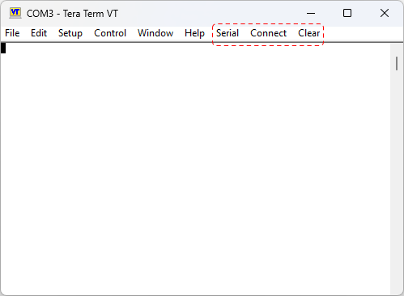

# TTXExtraMenus - Tera Term Plugin

([Japanese](./README-ja.md))

The TTXExtraMenus plugin adds existing menu items to the Tera Term menu bar.

Many embedded system engineers use Tera Term for UART (COM port) access.
Among its features, Clear Buffer and COM settings/selection are used frequently, and it is convenient 
to have those menus available directly on the menu bar.

This plugin also supports a Connect menu (ID 55200) to toggle connect/disconnect for COM ports.
(An equivalent feature could not be found in upstream Tera Term, so this is implemented as a custom hack.)

## Installation

1. Download and extract the Tera Term v5.3 release.

	https://github.com/TeraTermProject/teraterm/releases/download/v5.3/teraterm-5.3.zip

2. Download the plugin, unzip it and copy `TTXExtraMenus.dll` to the extracted `teraterm-5.3` directory.  
	(`ttermpro.exe` must be in the same directory.)

	https://github.com/hatomugi-cha/TTXExtraMenus/releases/download/v5.3-1.0/TTXExtraMenus-v5.3-1.0-x86.zip

## Default Extra Menus

* `Serial` - Opens "Setup -> Serial port..."
* `Connect` - Toggles connect/disconnect to a COM port
* `Clear` - Opens "Edit -> Clear buffer"

## Configuration

After installing TTXExtraMenus.dll, when you launch ttermpro.exe, the following default settings are written 
to the TERATERM.ini file.

	 [ExtraMenus]
	 Menu=Serial:50350, Connect:55200, Clear:50260
	 Enabled=True

* Consists of pairs in the form of "MenuName:MenuID".
* [Tera Term - Menu ID List](https://teratermproject.github.io/manual/5/en/reference/menu_id.html)

## Build

1. In a Command Prompt on Windows11, run the command to enable Microsoft Visual Studio 2022 Environment.

       C:\"Program Files"\"Microsoft Visual Studio"\2022\Community\VC\Auxiliary\Build\vcvars32.bat

   Or, click `x86 Native Tools Command Prompt for VS 2022` in a Windows Menu.

2. Run build.bat in the Command Prompt

       build.bat

   Build artifacts will be at Release\TTXExtraMenus.dll, and it's copied under out\teraterm-5.3\.

3. (option) build-teraterm.bat will build `out\teraterm\teraterm\Release\ttermpro.exe`.

## Acknowledgements

Tera Term is used worldwide as essential software for communication with embedded devices.
Special thanks to all developers involved in Tera Term.

## References

 - [Tera Term Source Code Guide - Plugin Support](https://teratermproject.github.io/manual/5/en/reference/sourcecode.html#plugin)
 - [Tera Term - Menu ID List](https://teratermproject.github.io/manual/5/en/reference/menu_id.html)

## Author of TTXExtraMenus Plugin

hatomugi-cha

END
